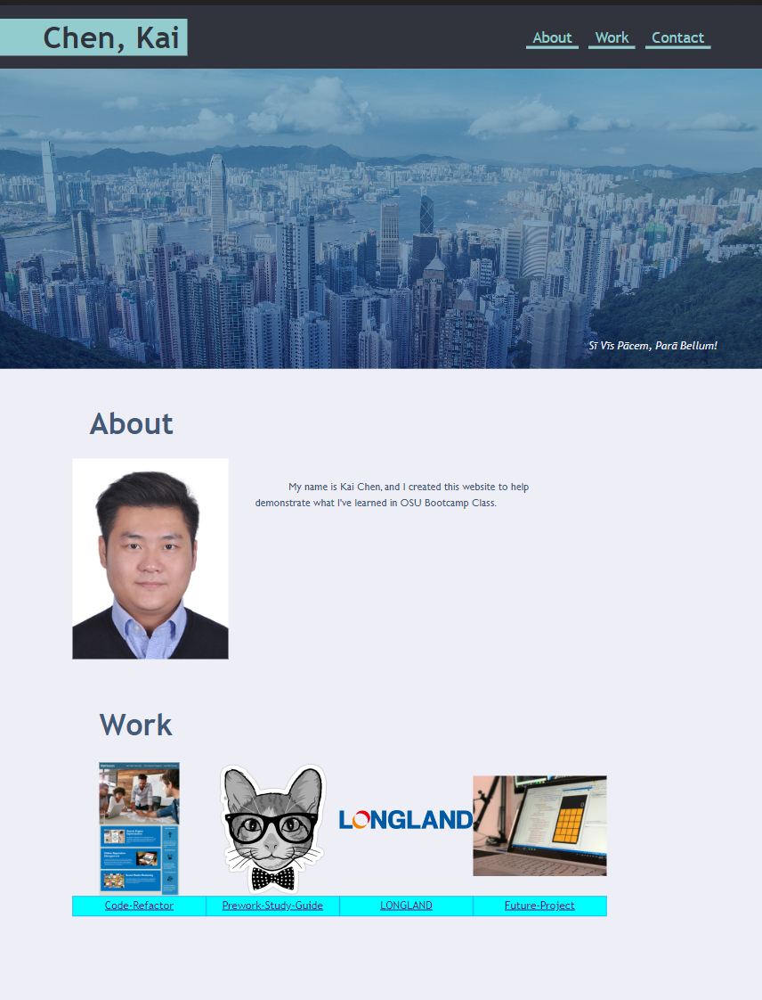

# KaiChen_PortfolioSite for Week 2 Challenge

## Descrption
This is our second homework project websit for my personal portfolio.

This portfolio site presents my name, a business profile picture of me, and links to all my works and contacts.
When the user click on the navigation bar, the site should jump to its section corelatively.
For all of my works I have presented a clickable screenshot or icon, of which once clicked should take the user to the right websites.
The first application is presented in a larger size than others.
This site should resize itself according to the user's screen size.

A link to the deployed website is https://ronin1702.github.io/KaiChen_PortfolioSite/

## Below is a Screenshot example of the final website

## Credits
I worked on this project with given starter codes.